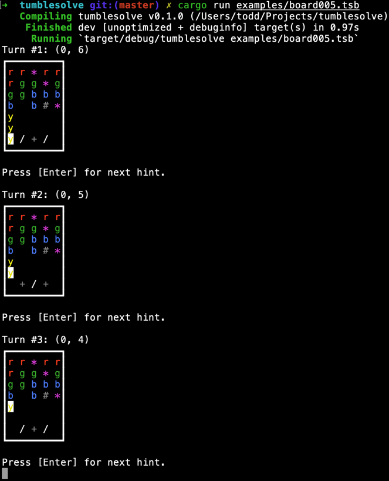

Tumblesolve
===========

`tumblesolve` is an interactive, hint-at-a-time solver for the puzzle game
[Tumblestone](http://www.tumblestonegame.com/). I wrote this several years back
in order to get past a particularly pernicious puzzle. And then I updated it a
few times as the game introduced new mechanics (and I hit new roadblocks). I
honestly don't remember if it covers all the game's mechanics; I'm sure I beat
the game, so at some point I stopped getting stuck, possibly without encoding
all the mechanics.

The solver is currently a simple CLI. It expects a terminal capable of both ANSI
color and Unicode rendering, e.g., modern VT 100; you'd probably have to go out
of your way on a Unix-based system to find an unsupported terminal. I have no
idea what it does on Windows, because I've never tried it, but it probably runs
fine under MinGW _et alia_. There really weren't good GUIs for Rust back in the
day; nowadays, I'd probably slap on something like
[_egui_](https://github.com/emilk/egui) to serve as the frontend.

Setup
-----

Make sure you have a stable Rust toolchain capable of targeting Edition 2021:

```shell
# Install Rust. You'll get a recent stable toolchain.
curl --proto '=https' --tlsv1.2 -sSf https://sh.rustup.rs | sh
```

Then you just need a board to solve. You can find example boards in
[`examples`](examples). They are just UTF-8-encoded plain text files, so any
text editor will suffice.

The file format is basically broken into two parts: _(1)_ a section of
properties that describe the board _in toto_ and _(2)_ the board itself, as a
grid of representative tokens.

The file format recognizes the follow leading properties:
* `width = «tokens»`, where _«tokens»_ specifies the expected number of tokens
  per row of the game board.
* `wild = «colors»`, where _«colors»_ specifies the colors for wild stones,
  e.g., `rgb` for red, green, and blue.
* `colorlock = «boolean»`, where _«boolean»_ — which is either `true` or `false`
  — says whether a color remains locked once completed (and cannot be played
  until another color has been played).

Any other property of the form `x = y` is ignored. `solvable`, seen in some
example boards, is just a note about whether the board is actually solvable; the
program doesn't use this information in any way.

Separating the properties from the board is a special delimiter, `---`.
Following this delimiter are the board rows themselves. Each row comprises
whitespace-separated tokens drawn from this inventory:
* `_`: Empty cell, i.e., no stone.
* `#`: Survivor stone, i.e., untargetable but disappears when the last
  non-survivor stone is removed from its enclosing row.
* `*`: Wild stone, i.e., can match one or more colors.
* `/`: Open toggle stone.
* `+`: Closed toggle stone.
* _any other single character_: An ordinary colored stone. (I didn't know what
  colors were going to exist by the end of the game, so I allowed any other
  characters to be used.)

(A toggle stone alternately obstructs and permits access to stones above it
based on turn number.)

Running
-------

Once you have a board, you can run the solver. Here's an
[example&#32;board](examples/board005.tsb) taken directly from the
[`examples`](examples) directory. This board is representative of certain levels
from the game, but is not directly taken from the game itself.

```text
solvable = yes
wild = rgb
colorlock = true
r = 9
g = 28
b = 27
y = 11

---

r r * r r
r g g * g
g g b b b
b _ b # *
y _ _ _ _
y _ _ _ _
y / + / _
```

To solve this board, you just provide its file path as the sole command-line
argument:

```shell
$ cargo run examples/board005.tsb
```

_N.B._: Here I have assumed that you are just running the program from the
project folder. If you install a release version as, say, `tumblesolve`, then
you'd modify (your `$PATH` and) the command to be this:

```shell
$ tumblesolve path/to/board005.tsb
```

Finally, here's a screenshot of the beginning of the transcript:



The highlighted character represents the stone to remove. (In each case shown in
the transcript, it's a yellow stone.)

You hit `Enter` to get the next hint, or `^C` to interrupt the process and kill
the program. In this way, you decide how many hints you want. The last few steps
will generally always be obvious, but are included anyway for completeness.

That's all, folks!
